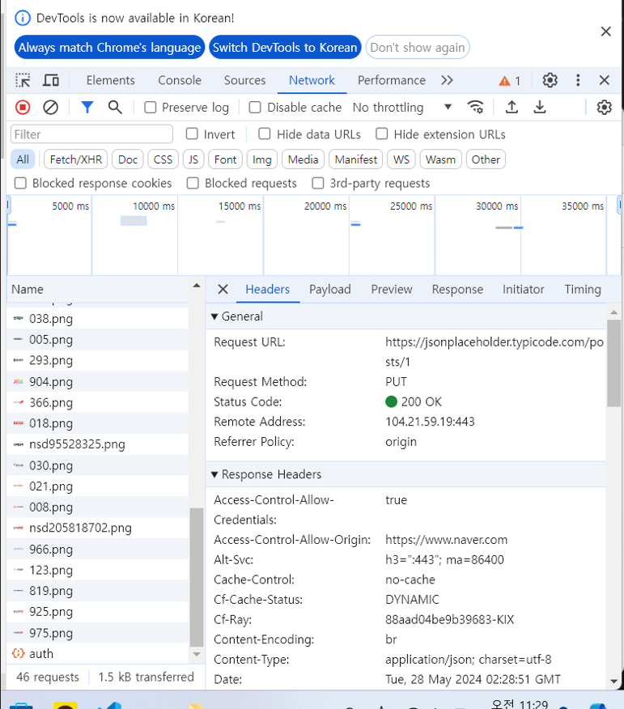
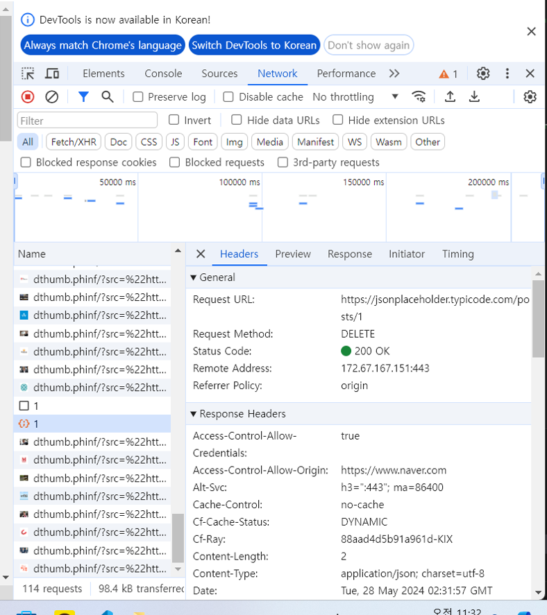

## 웹 개발 스터디 3주차

### GET,POST,PUT,PATCH,DELETE를 직접 체험해보고 그 사용 사례를 정리한다.
1. GET
- 주로 데이터를 읽거나 검색할 때에 사용되는 메소드
- 객체의 사용하는 메소드
- 객체가 가진 프로퍼티의 값을 구할 때 사용
- 같은 요청을 여러 번 하더라도 항상 똑같은 응답
- 데이터를 변경하는 연산에는 사용X

<사용사례>

2. POST
- 주로 새로운 리소스를 생성할 떄, 특히 부모 리소스의 하위 리소스들을 생성하는데 사용
- 같은 요청을 반복해서 하더라도 같은 결과물을 보장하지 않는다
- 두개의 요청 -> 두개의 다른 resouce 반환할 가능성 높다

<사용사례>

3. PUT
- 리소스를 생성 또는 업데이트하기 위해 서버로 데이터를 보내는데 사용
- 요청을 반복 -> 항상 동일한 결과가 생성

<사용사례>

4. PATCH
- 지시에 따라 텍스트 파일을 업데이트하는 유닉스 프로그램
- 사용자에게 제공되는 즉각적인 해결책
- 웹사이트로 다운받아 프로그램의 일부를 빠르게 고친다

<사용사례>

5. DELETE
- 지정된 리소스를 삭제
- Body값과 Content-type값이 비워져 있다
- 어떤 데이터를 삭제할지 파라메터 받음
- 성공 -> Body값 없이 성공 응답만 보냄

<사용사례>

### HTTP/1.1,HTTP/2,HTTP/3의 차이점을 학습하고 그 역사를 정리한다
> HTTP : Hyper Text Transfer Protocol 
>   > HTML을 전달할 수 있는 프로트콜(웹 통신의 기초 역할)
1. HTTP/1.1 (TCP)
##### 현대에서 가장 많이 쓰이고 있는 HTTP 버전인 1.1
- 단일 요청과 응답 사이에 순차적의 통신 -> 텍스트 문자 형태로 전송
- 1.1버전에서 추가적인 네트워크 오버헤드인 RTT가 발생
(RTT : Round Trip Time)
- CSS를 좌표값으로 이용
> Image Spriting
2. HTTP/2 (TCP)
- 텍스트가 아닌 이진 프레임인 Byte 형식 데이터로 전송
- RTT가 발생하는것을 해결하기 위해 Multiplexing 개념 이용
> Multiplexed Streams : 커넥션 한 개로 동시에 여러개의 메시지 주고받음/ 응답 순서에 상관없이 Stream으로 주고 받는 방식
- 리소스 간의 의존관계에 따른 우선순위를 설정
> Stream Prioritization(스트림 우선순위)
3. HTTP/3 (UDP)
- TCP프로토콜에서 UDP로 변경함 : UDP기반으로 멀티 플렉싱 지원
- 연결 레이턴시 감소 : 정보와 데이터 함께 보낼 수 있음
- QUIC라는 프로토콜을 만들어 패킷 손실 감지에 걸리는 시간 단축
<역사>
> HTTP/1.1 1997년에 나온 프로토콜(1.0에서 개선된 것)
>   > 1.1 버천은 파이프라인을 이용 - 여러요청 처리 
>   > BUT! 요청끼리의 순서대로 응답을 받는것 : 먼저 온 요청이 끝나지 않으면 그 뒤 요청 처리 불가
>   > HTTP/2 2015년에 나온 프로토콜,병렬 커넥션 부활,멀티 플렉싱 지원 -> TCP 연결 안에서 병렬 처리 가능
>   >   > TCP 패킷 속 값이 네트워크 경로에서 손실 
>   >   > HTTP/3 2022년에 나온 프로토콜, QUIC 프로토콜 도입, UDP를 사용하여 네트워크 지연 최소화, 패킷 손실 최소화
### GET,POST 메소드의 헤더 분석하여 각각의 역할을 정리한다(Content-Type, Accept, Authorization 등)
1. GET 메소드
- 정보를 요청
- URL 파라미터에 데이터 - Body 필요없음
- 동일한 요청 : 항상 같은 결과
2. POST 메소드
- 정보의 생성 요청
- Body에 데이터 담음
- 동일한 요청 : 다른 결과 나타날 수 있음
#### Content-Type, Accept, Authorization 등
(공통 Request& Response header)
1. content-Type : 컨텐츠의 타입과 문자열 인코딩 명시
(요청 Request header)
2. Accept : 요청을 보낼 때 서버에 요청하는 타입 명시(text/html 등)
3. Authorization : 인증 토큰을 서버로 보낼 때 사용하는 헤더
(응답 Response header)
4. Server : 웹 서버 정보